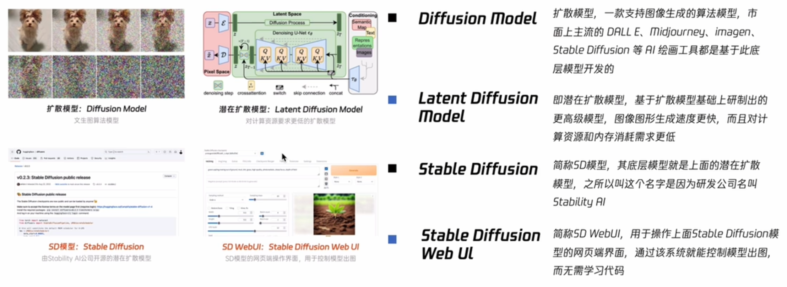
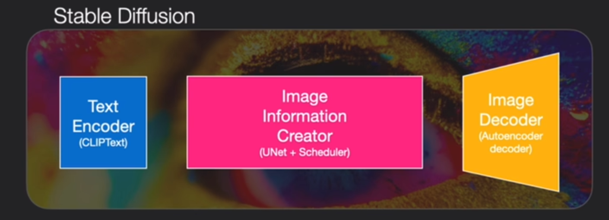
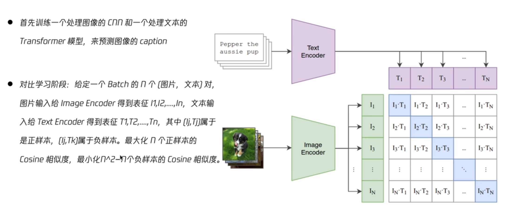
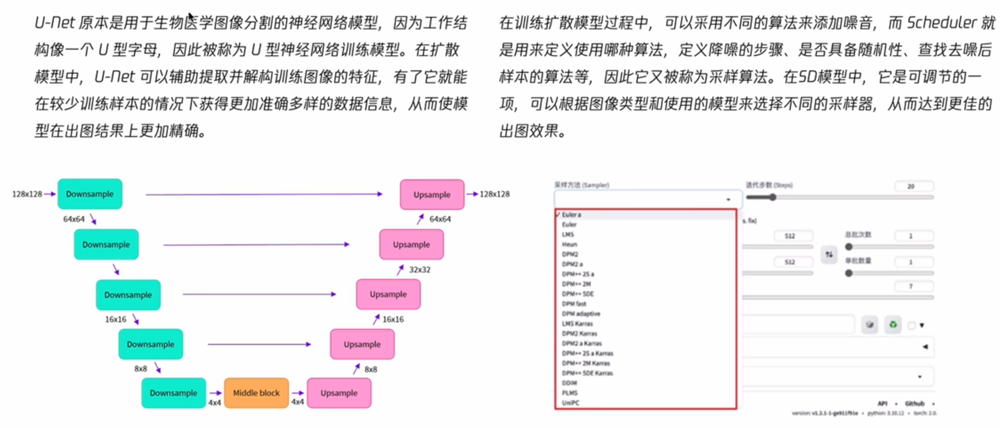

# 03-SD模型原理

## 3.1 Stable Diffusion简介

区分四个概念

潜在扩散模型的过程，使用Unet网络去噪。图像变为低维的特征放入潜在空间Latent Space，最后特征通过解码器变为图像，大大减少了计算量。

SD使用clip做词嵌入

特点：可拓展强，出图速度快，可精准控制分辨率，数据安全

## 3.2 SD模型原理

### 3.2.1 Diffusion Model的工作原理

伪代码过程：

### 3.2.2 Stable Diffusion的架构

ClipText：文本编码器，将提示词变为向量

扩散模型：文本+噪声组成初始向量，输出是一个向量

解码器：将向量变为最终的图片

### 3.2.3 CLIP

Open AI：构建文本对 Contrastive Language Image Pretraining

### 3.2.4 Unet网络

下采样+上采样，由大变小再小变大。Scheduler进行去噪处理

### 3.2.5 VAE

对最后一个时间步的潜在特征进行解码即可获得清晰的图像

## 3.3 SD处理流程

## 3.4 SD应用场景

文生图、图生图、图像修复