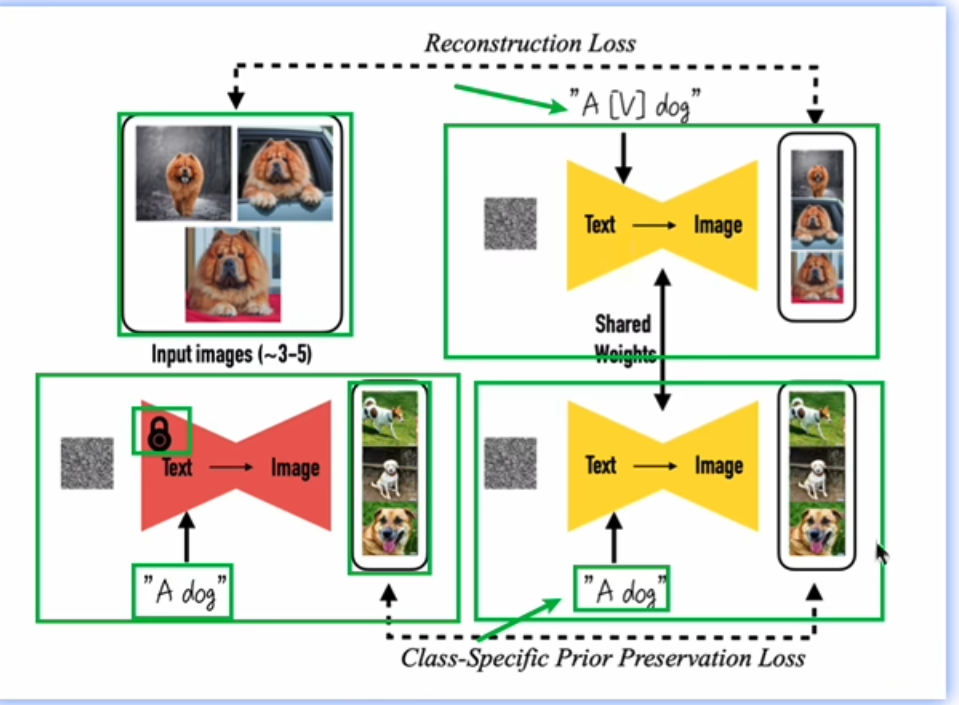
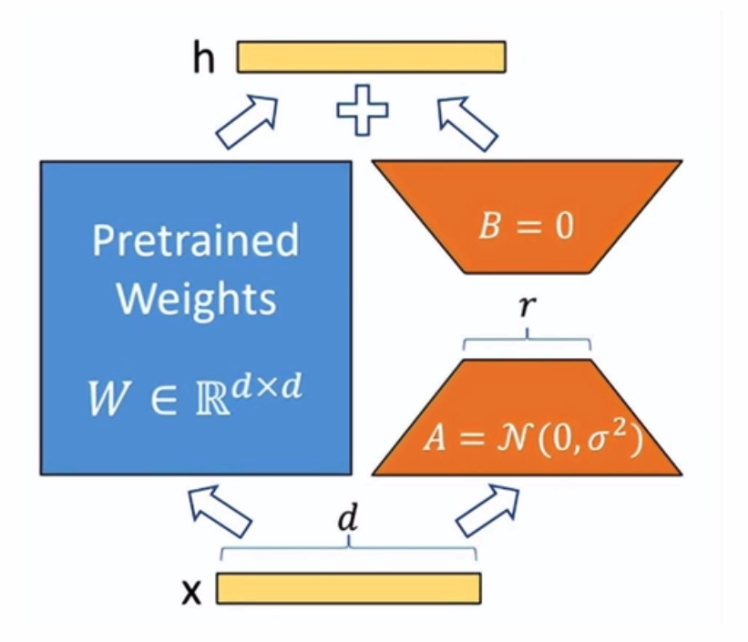

# 04 SD模型的训练和部署

## 4.1 Hai平台

类似于云服务器，腾讯云的，集成了一些大模型的环境

应用：作画，Agent写作，

## 4.2 创建Stable Diffusion实例

登录平台

## 4.3 Stable Diffusion的训练

四种训练方法：

### dreambooth

加速器：accelerate.sh

### LoRA

NLP领域小参数训练，减少资源消耗。应用到图片生成领域，可以利用小资源进行定制化需求

$w=w_0+BA$ 

LoRA的数据集包含图片和文本文件，文本文件记载着对应图片的文本描述。

train.sh调整训练的参数

需要预训练的原始模型，然后准备数据集(文本+图片)。构建LoRA的模型参数，设置LoRA参数降维的维度，进行训练参数

## 4.4 Stable Diffusion的预测