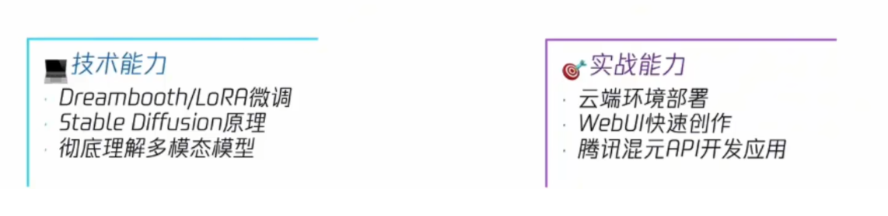
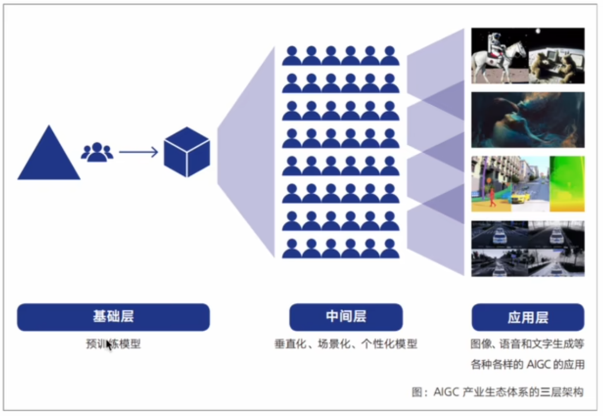

# 01 AIGC简介

课程内容

学习技术栈：

## 1.1 AIGC

AIGC：（**人工智能生成内容**，Artificial Intelligence Generated Content）是指由人工智能技术生成的各种形式的内容，通常包括文字、图像、音频、视频等。这些内容通常是通过自然语言处理（NLP）、计算机视觉、机器学习、生成对抗网络（GANs）等技术来自动生成的。

## 1.2 内容和应用

文本生成，图像视频生成，音频生成，多模态生成……

生成一堆东西，我天天用来写代码；生成虚拟视频、虚拟主播……

## 1.3 产品形态

三层架构

基础层：大厂的大模型卖API。stable disfussion……

中间层：基于大模型做改进，个性化的场景。二次元风格……

应用层：面向用户的。网站、小程序……

