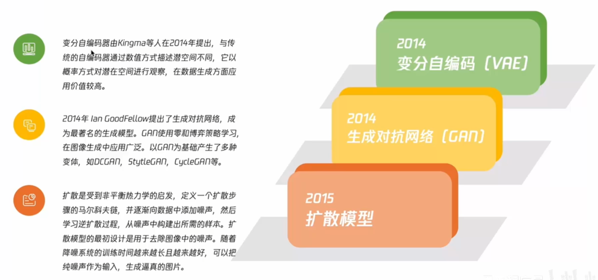
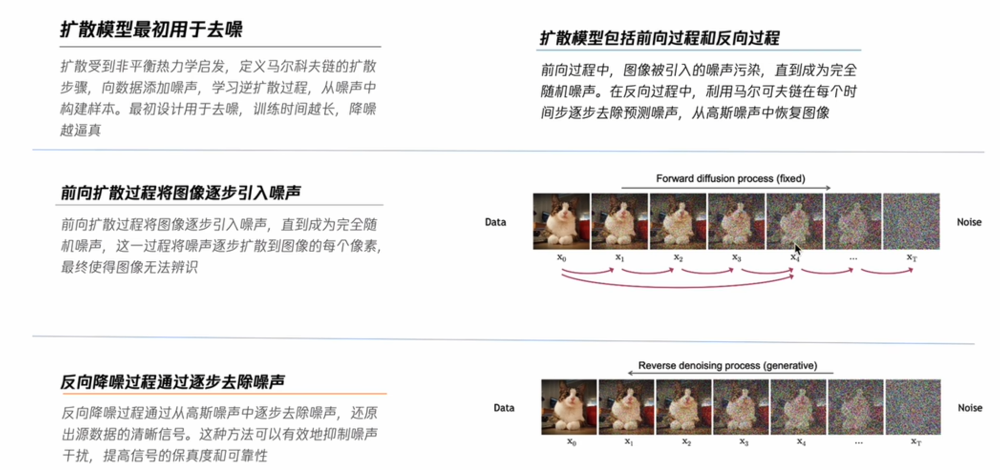
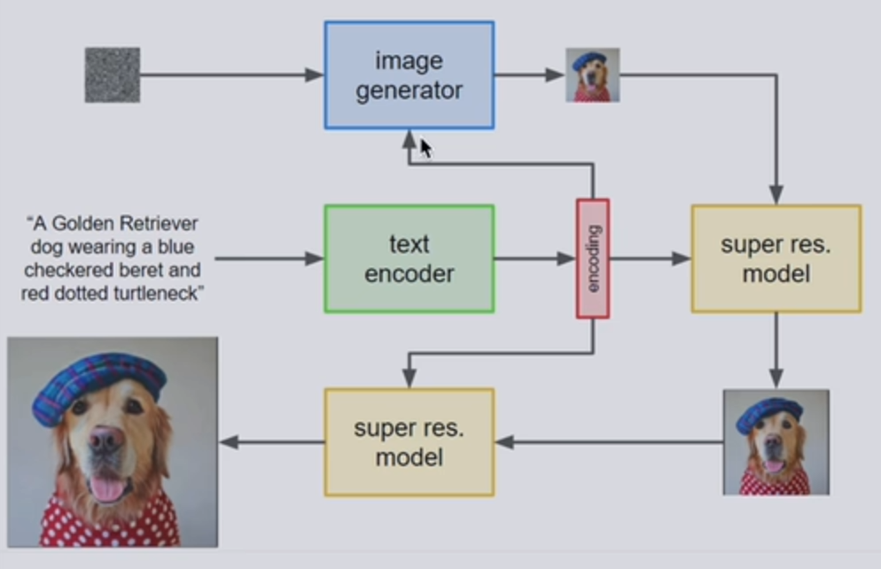

# 02 图像生成

## 2.1图像生成算法

VAE，GAN，扩散模型

### 2.1.1 VAE 变分自编码

**变分自编码器（Variational Autoencoder, VAE）** 是一种生成模型，它通过自编码器结构和变分推断相结合，能够学习数据的潜在表示，并且用于生成新样本。

用高斯分布的均值和方差来描述特征，Encoder进行学习，利用这些特征Decoder可以生成新的图片

VAE结合了**自编码器（Autoencoder, AE）** 和 **变分推断（Variational Inference）** 的思想，旨在通过学习数据的低维潜在空间（latent space）来生成数据。VAE主要由两个部分组成：

1. **编码器（Encoder）**：将输入数据映射到潜在空间（latent space），即对输入数据进行编码，将其表示为潜在变量的分布。
2. **解码器（Decoder）**：从潜在空间的样本中重建输入数据，解码器将潜在变量映射回数据空间，尽可能地恢复原始数据。

#### VAE的核心思想：

VAE的核心目标是通过最大化数据的对数似然估计来学习数据的潜在分布。然而，直接进行对数似然估计计算是不可行的，因此VAE采用了**变分推断**的方法来近似该目标。

### 2.1.2 GAN对抗生成网络

**Generative Adversarial Networks**

Generator和Discriminator。向量输入给生成器，声称对应的图片；判别器收到一张图片，越接近1越说明是真实的数据。

生成器和判别器对抗。DCGAN，StyleGAN，CycleGAN。

图片生成的时候仅需要使用生成器

应用：人脸替换，卡通头像生成，超分辨率，风格迁移

### 2.1.3 扩散模型

**Diffusion Model扩散模型。**

利用马尔可夫链的扩散步骤，像数据中添加噪声，学习**逆扩散**的过程，从噪声中生成样本。

学习图片变为噪声的过程的逆过程，从噪声中构造出所需的图片样本。

前向fixed，后向generative。扩散模型复原后的图像为**变种**，和原图不一致

**应用**:超分，上色，文生图

## 2.2 基于扩散模型的图像生成算法

### 2.2.1 DALL-E

Open-AI文生图

### 2.2.2 Imagen

Google文生图

从低分辨率到高分辨率生成的。

文本经过text encoder，特征三次输入

### 2.2.3 Stable Diffusion

Stability AI团队的开源模型

